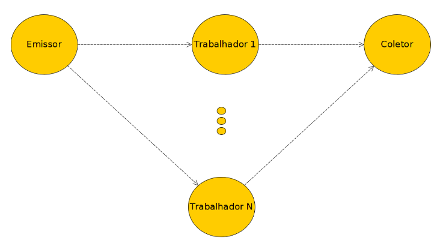
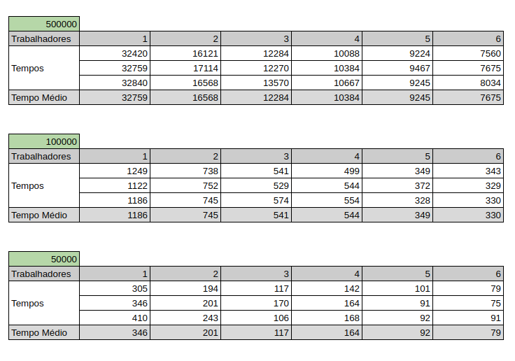
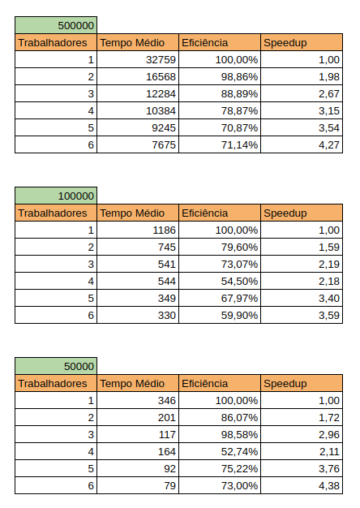
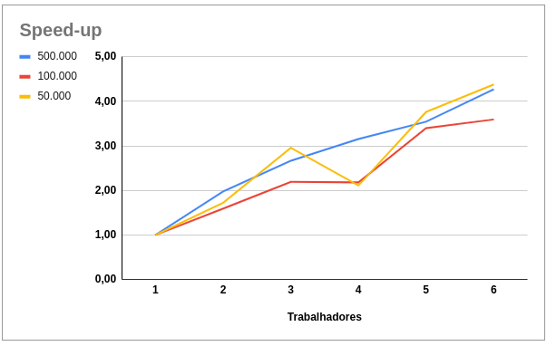
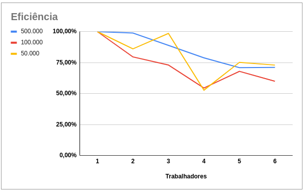

# parallel-programming-mpi

### Implementação do padrão FARM usando OpenMPI

Com o intuito de calcular a quantidade de números primos presentes no intervalo de um dado número e apresentar resultados de performance obtidos com o paralelismo da operação, este projeto apresenta uma implementação do padrão FARM utilizando o OpenMPI em C++.

Neste projeto o padrão é organizado com 1 Emissor, 1 ou mais Trabalhadores e 1 Coletor.



O Emissor recebe a solicitação de cálculo e o repassa aos Trabalhadores que por sua vez realizam cada um uma fatia da tarefa, a executar e envia o resultado ao Coletor, que por sua vez, unifica e apresenta o resultado final.

Exemplo: Ao calcular a quantidade de números primos até 1000, tendo 2 Trabalhadores, o primeiro se encarregará do intervalo 1 - 500 e segundo do intervalo 501 - 1000.

#### Compilação

```bash
mpic++ -o3 -std=c++1y -Wall parallel-mpi-prime-number.cpp -o exe
```
#### Inicialização
```bash
mpirun -np 8 --machinefile /home/mpihpc/.cluster_hostfile ./exe 100000
```

### Ambiente de Execução
O ambiente de execução foi montado com 4 VMs Ubuntu Server 23.10, virtualizadas com Oracle VM VirtualBox, cada VM contou com 2GB de memória e 2CPUs (com restrição de execução de 50%).

Possibilitado rodar a aplicação com até 8 nodos (1 Emissor, 6 Trabalhadores e 1 Coletor).

O processador utilizado foi um Intel Core i5-1135g7 @ 2.40GHz 1.38 GHz.

### Resultados

Foram realizados testes com três níveis de carga, calculando a quantidade de números primos até 500.000, 100.000 e 50.000, iniciando com o modo sequencial (apenas 1 Trabalhador) e paralisando com até 6 Trabalhadores. Cada uma dessas configurações foi executada 3 vezes. 

Os tempos apresentados a seguir estão em milissegundos.



A média desses tempos foi utilizada para calcular o Speedup obtido com a paralisação, o qual se dá pela divisão do tempo da execução sequencial pelo tempo da execução paralela. Possibilitando assim a visualização da real eficiência entregue pela paralelização deste processo. 





### Conclusão 
Dado a natureza ambiente de testes utilizado, com a incapacidade de isolar o processamento desta atividade, tendo concorrência com o SO da máquina física, não é possível afirmar que os resultados obtidos possam ser replicados com coerência.

Em ambos os testes realizados, constatou-se um bom desempenho, paralisando o processo com 2 e 3 Trabalhadores.

Embora apresente redução nos tempos de execução, a paralisação com 4 à 6 Trabalhadores apresentou reduções consideráveis de eficiência.
